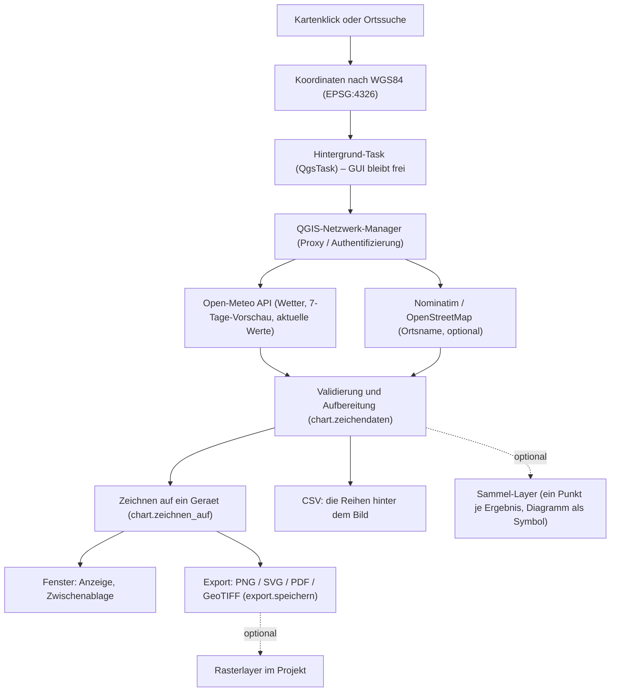
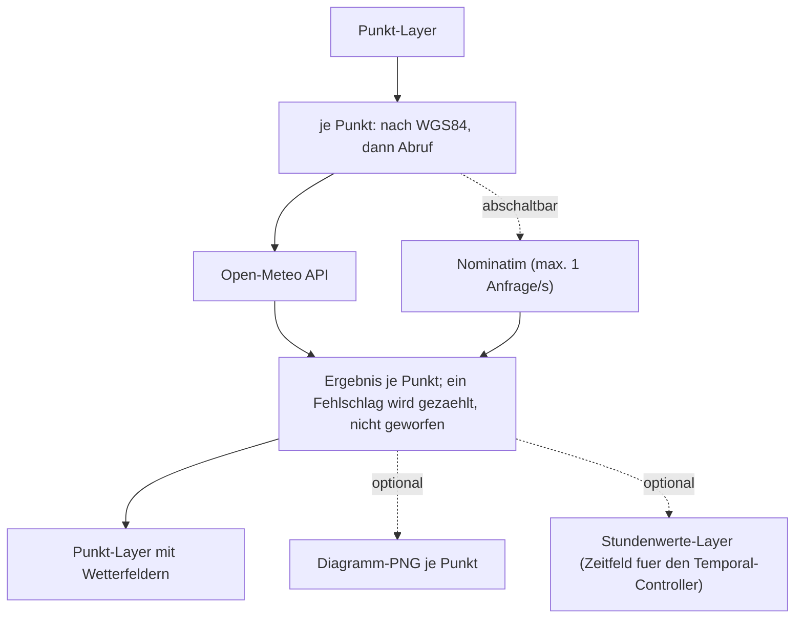
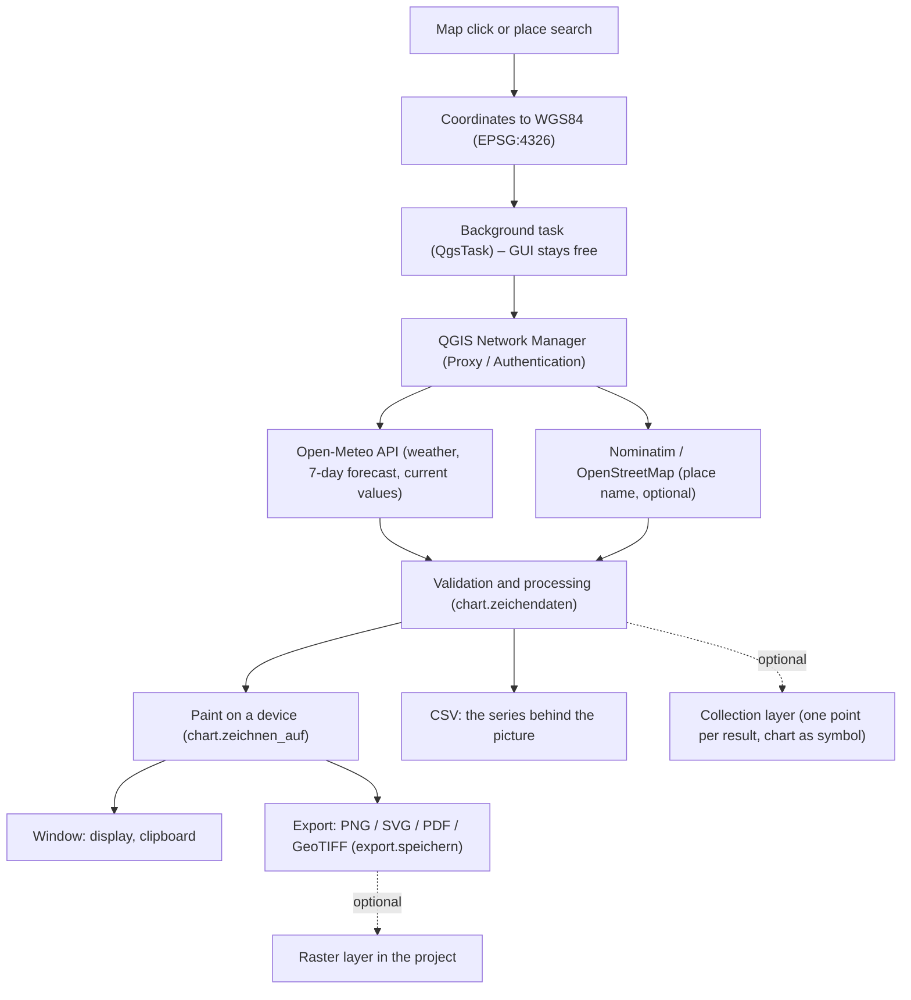
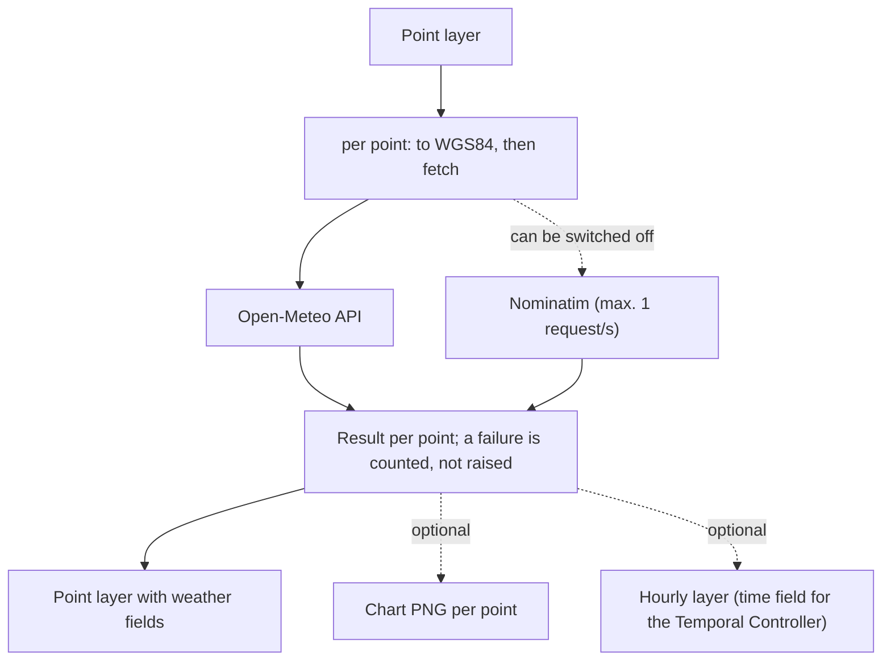

<div align="center">


<h1>Weather Picker — QGIS-Plugin</h1>

<p>
<strong>Auf die Karte klicken → Wetterdaten inkl. 7-Tage-Vorschau als Diagramm.</strong><br />
<strong>Click the map → weather data incl. 7-day forecast as a chart.</strong>
</p>

[](https://qgis.org)
[](metadata.txt)
[](LICENSE)
[](https://open-meteo.com)
[](https://creativecommons.org/licenses/by/4.0/)
[](#konfiguration)

<br />


<p><a href="#deutsch">Deutsch</a> | <a href="#english">English</a></p>

</div>

---

<a name="deutsch"></a>
## Deutsch

Wetterauskunft inklusive 7-Tage-Vorschau für eine angeklickte Koordinate, einen
gesuchten Ort oder einen ganzen Punkt-Layer. Temperatur- und Niederschlagsverlauf
(inklusive Schnee) erscheinen als pixelscharfes Diagramm, ergänzt um den
nächstgelegenen Ort. Das Diagramm lässt sich in fünf Formaten speichern, als
georeferenziertes Raster in die Karte legen und als Symbol an jeden gesammelten
Punkt hängen. Die Wetterdaten stammen von der [Open-Meteo-API](https://open-meteo.com),
die Ortsnamen von [OpenStreetMap](https://www.openstreetmap.org/copyright). Die
Oberfläche folgt automatisch der QGIS-Sprache (Deutsch/Englisch).

### Inhaltsverzeichnis

- [Funktionen](#funktionen)
- [Installation](#installation)
- [Verwendung](#verwendung)
- [Konfiguration](#konfiguration)
- [Datenschutz](#datenschutz)
- [Architektur](#architektur)
- [Projektstruktur](#projektstruktur)
- [Entwicklung und Tests](#entwicklung-und-tests)
- [Mitwirken](#mitwirken)
- [Lizenz und Daten](#lizenz-und-daten)

### Funktionen

**Diagramm**

- Geglättete Temperaturkurve und Niederschlag (inklusive Schnee und Schauer), Ist-Temperatur als große Zahl im Kopf
- Gleitendes 24-Stunden-Tagesmittel als zweite Trendlinie; kumulierter Niederschlag ab „jetzt" als gestrichelte Treppenlinie mit eigener Skalierung
- Tagesstreifen unter der Datumsachse mit Temperaturspanne und Niederschlagssumme je Tag
- Zeitraum per Mausrad zoomen und per Ziehen verschieben; beim Hineinzoomen erscheinen Uhrzeiten am Zeitstrahl
- Aktuelle Bedingungen und heutige Tageswerte: gefühlte Temperatur, Wind mit Windstärke in Beaufort, Luftfeuchte, Wettercode (WMO), Tagesmin und -max, Niederschlagssumme
- Tagesmittel und kumulierte Summe sind einzeln abschaltbar, der Zustand gilt auch für das nächste Ergebnis
- Scharfes HiDPI-Rendering (`devicePixelRatio`), locale-korrekte Datums- und Zahlenformate

**Export**

- Speichern als **PNG, SVG, PDF, CSV oder GeoTIFF**; der Knopf klappt die Formate direkt auf
- Die CSV enthält die Reihen hinter dem Bild: Zeit, Temperatur, Niederschlag, 24-Stunden-Mittel, kumulierte Summe
- **GeoTIFF am Abfragepunkt** in 300 dpi, wahlweise gleich als Rasterlayer im Projekt
- Kopieren in die Zwischenablage; die Quellenangabe wird in jede exportierte Grafik gezeichnet

**Karte und Layer**

- Optionaler Sammel-Layer: jedes Ergebnis wird zu einem Punkt mit Attributen
- **Diagramm als Kartensymbol** an jedem gesammelten Punkt, feste Größe in Millimetern und damit in jeder Zoomstufe lesbar
- Sprechblase mit dem Diagramm beim Überfahren eines Punktes, Layer-Aktion **„Diagramm öffnen"** für das PNG im Standardprogramm
- Klick-Marker auf der Karte am zuletzt abgefragten Punkt
- **Aufräumen** in den Einstellungen löscht Diagramm-Dateien, auf die kein Punkt mehr zeigt

**Stapelverarbeitung**

- **Processing-Algorithmus „Wetter für Punkte"** für einen ganzen Punkt-Layer: Werkzeugkiste, Modellbauer und Skript
- Ein fehlgeschlagener Abruf bricht den Lauf nicht ab, sondern wird am Ende gezählt
- Optionaler **Stundenwerte-Layer** mit einer Zeile je Punkt und Stunde, vorbereitet für den **Temporal-Controller**

**Integration**

- Nicht-blockierender Abruf über `QgsTask`; QGIS bleibt während des Ladens bedienbar
- Ergebnis in einem wiederverwendeten, nicht-modalen Fenster, dadurch schnelles Durchklicken über die Karte
- Netzwerkabruf über den QGIS-Netzwerk-Manager, respektiert Proxy und Authentifizierung (etwa NTLM/Kerberos im Firmennetz)
- Eigene Einstellungen für Endpoint, Schlüssel und Einheiten
- Zweisprachig DE/EN, folgt automatisch der QGIS-Oberflächensprache; Übersetzungen in `locales/*.json`

### Installation

Aus dem QGIS-Plugin-Manager (sobald veröffentlicht): *Erweiterungen → Erweiterungen verwalten und installieren → nach „Weather Picker" suchen*.

Manuell aus ZIP: *Erweiterungen → Aus ZIP installieren* und die Plugin-ZIP wählen.

Aus dem Quellcode — Ordner in das QGIS-Plugin-Verzeichnis kopieren und QGIS neu starten:

```bash
# Windows
%APPDATA%\QGIS\QGIS3\profiles\default\python\plugins\

# Linux
~/.local/share/QGIS/QGIS3/profiles/default/python/plugins/

# macOS
~/Library/Application Support/QGIS/QGIS3/profiles/default/python/plugins/
```

Voraussetzung ist QGIS 3.22 oder neuer. Zusätzliche Python-Pakete braucht das
Plugin nicht; einzig der GeoTIFF-Export greift auf die GDAL-Python-Anbindung
(`osgeo`) der QGIS-Installation zu — dieselbe, die auch die GDAL-Werkzeuge in der
Verarbeitungswerkzeugkiste nutzen.

### Verwendung

#### Werkzeugleiste

Die Werkzeugleiste **geoObserverTools** enthält den Knopf **Weather Picker** mit Ausklapp-Pfeil:

- **Knopf** (Karten-Symbol) — aktivieren und auf die Karte klicken; das Diagramm erscheint in einem Fenster. Erneuter Klick deaktiviert das Werkzeug.
- **Pfeil** — klappt das Menü auf:
  1. **Ort suchen …** (Lupe) — Ort oder Adresse eingeben; die Karte schwenkt zum Treffer und zeigt dessen Wetter.
  2. **Punkte sammeln** (Aufnahme-Symbol, Umschalter) — schreibt jedes Ergebnis als Feature in einen Sammel-Layer.
  3. **Einstellungen …** — Endpoint, Schlüssel, Einheiten, Kartensymbol und Aufräumen.

> [!NOTE]
> Das Projekt-Koordinatensystem ist beliebig — das Plugin transformiert intern nach WGS84 (EPSG:4326).

#### Im Ergebnisfenster

Der Zeitraum lässt sich per Mausrad am Cursor zoomen und per Ziehen verschieben;
Escape oder der Knopf **„Ansicht zurücksetzen"** stellt die Gesamtansicht wieder her.
Je weiter hineingezoomt wird, desto feiner erscheinen Uhrzeiten am Zeitstrahl
(12, 6, 3, 2, 1 Stunde); der Schritt richtet sich nach dem Platzbedarf der
Beschriftung. Bei gezoomter Ansicht nennt eine Zeile im Kopf den sichtbaren Bereich
mit Datum, Jahr und Uhrzeit, und der Dateiname des Exports trägt ihn ebenfalls.

Der Speichern-Knopf schreibt im zuletzt gewählten Format; sein aufklappbares Menü
bietet **PNG, SVG, PDF, CSV und GeoTIFF** einzeln an, dazu den Eintrag, das GeoTIFF
gleich als Rasterlayer zu laden. Das Format folgt der Endung im Dateinamen, nicht dem
angeklickten Menüeintrag: Wer im GeoTIFF-Eintrag eine `.png` tippt, bekommt ein PNG.

#### GeoTIFF in der Karte

Das GeoTIFF steht mit der Unterkante auf dem Abfragepunkt; seine Bodenbreite folgt
dem aktuellen Kartenausschnitt, sodass das Bild hinterher so groß ist, wie es beim
Export ausgesehen hat. Gerendert wird in 300 dpi (4000 × 2231 Pixel), damit das
Diagramm im Drucklayout und beim Hineinzoomen scharf bleibt. Bei geografischem
Karten-CRS weicht der Export auf die passende UTM-Zone aus — in EPSG:4326 wäre das
Diagramm um `cos(Breite)` verzerrt. Layer- und Dateiname tragen Ort und Abrufzeit,
sodass zwei Vorhersagen derselben Stelle nebeneinander bestehen können.

Der Eintrag **„Als GeoTIFF speichern und in die Karte laden …"** fragt nur bei
gespeichertem Projekt nach einem Ort; der Dialog öffnet dann im Projektordner. Ist das
Projekt noch nicht gespeichert, landet die Datei ohne Rückfrage im Temp-Ordner des
Betriebssystems.

> [!WARNING]
> QGIS behandelt einen Layer aus dem Temp-Ordner als temporär. Unter Windows kann QGIS
> abstürzen, wenn ein Projekt mit solchen Layern verworfen wird (neues Projekt oder
> Beenden ohne Speichern). Das Betriebssystem darf den Temp-Ordner außerdem jederzeit
> leeren. Wer das GeoTIFF behalten will, speichert zuerst das Projekt.

#### Sammel-Layer und Kartensymbol

Ist **Punkte sammeln** aktiv, wird jedes Ergebnis zu einem Feature. Auf Wunsch trägt
jeder Punkt sein eigenes Diagramm als Kartensymbol — aus mehreren Abfragen wird damit
von selbst eine vergleichende Karte. Die Bilder liegen neben dem Projekt beziehungsweise
im Profilordner; **Aufräumen** in den Einstellungen löscht die, auf die kein Punkt mehr
zeigt. Die Sprechblase beim Überfahren zeigt dasselbe Diagramm, die Layer-Aktion
**„Diagramm öffnen"** holt es ins Standardprogramm.

#### Ganze Layer auf einmal

Für mehrere Punkte gibt es den Weg ohne Klicken: in der **Verarbeitungswerkzeugkiste**
liegt unter *Weather Picker* der Algorithmus **„Wetter für Punkte"**. Er nimmt einen
Punkt-Layer, liefert dieselben Felder wie der Sammel-Layer und auf Wunsch je Punkt ein
Diagramm sowie einen Stundenwerte-Layer für den Temporal-Controller. Die
Ortsnamen-Ermittlung ist dort standardmäßig aus: Nominatim erlaubt höchstens eine
Anfrage je Sekunde, das wären bei 200 Punkten rund vier Minuten allein dafür.

Der Algorithmus steht auch ohne geöffnetes QGIS zur Verfügung — über
`qgis_process run weather_picker:wetter_fuer_punkte`. Das Plugin meldet seinen
Provider dafür unabhängig von der Oberfläche an.

### Konfiguration

Das Plugin bringt einen eigenen Einstellungsdialog mit (im Ausklappmenü des Weather-Picker-Knopfs); darüber hinaus greifen QGIS-Einstellungen:

| Aspekt | Steuerung |
|---|---|
| Endpoint / API-Key | **Plugin-Einstellungen:** eigener Open-Meteo-Endpoint und optionaler Schlüssel — für kommerzielle oder self-hosted Nutzung. Vorgabe: kostenloser Endpoint ohne Schlüssel. Ein selbst gehosteter Endpoint muss das Stundenfeld `precipitation` liefern; fehlt es, erscheint eine Fehlermeldung, die das fehlende Feld benennt. |
| Einheiten | **Plugin-Einstellungen:** Temperatur °C/°F, Wind km/h · m/s · mph · kn, Niederschlag mm/inch. |
| Diagramm als Kartensymbol | **Plugin-Einstellungen:** Haken; ist er aus, bekommen neue Punkte kein Bild. |
| Aufräumen | **Plugin-Einstellungen:** Knopf; die Rückfrage nennt vorab die Zahl der Dateien, auf die kein Punkt mehr zeigt. |
| Punkte sammeln | **Umschalter** im Ausklappmenü des Weather-Picker-Knopfs — schreibt jedes Ergebnis in einen Punkt-Layer. |
| Tagesmittel / kumulierte Summe | **Haken unter dem Diagramm**; der Zustand wird gemerkt und gilt für das nächste Ergebnis. |
| Sprache (DE/EN) | QGIS: *Einstellungen → Optionen → Allgemein → Benutzeroberfläche* (System-Locale überschreiben). Deutsch → DE, sonst EN. |
| Datum/Zahlen | Folgen der Sprache bzw. dem Regions-Locale (z. B. `en_US` → `06/09`, `en_GB` → `09/06`). |
| Proxy / Authentifizierung | QGIS: *Einstellungen → Optionen → Netzwerk*. |
| Timeout | Fest 15 Sekunden (Wetter) bzw. 8 Sekunden (Ortsname); danach sauberer Abbruch. |
| Cache | Wetter bewusst ohne Cache (`forceRefresh`); Ortsnamen pro Position (~100 m) lokal, FIFO-begrenzt. |

### Datenschutz

Beim Klick werden die **Koordinaten** der angeklickten Position (zusammen mit Ihrer
**IP-Adresse**) an Open-Meteo übertragen. Laut Open-Meteo können Server-Logs solche
Daten zeitweise enthalten — siehe die [Open-Meteo-Nutzungsbedingungen](https://open-meteo.com/en/terms).
Für den **nächsten Ort** werden dieselben Koordinaten zusätzlich an
[Nominatim/OpenStreetMap](https://operations.osmfoundation.org/policies/nominatim/)
gesendet (Reverse-Geocoding). Ergebnisse werden pro Position lokal zwischengespeichert,
um die Anzahl der Anfragen gering zu halten. Das Plugin selbst schreibt Koordinaten
**nur gerundet (~1 km)** ins QGIS-Log.

Der Processing-Algorithmus überträgt dieselben Angaben für **jeden Punkt des
Eingabe-Layers** — bei einem Layer mit 200 Punkten also 200 Koordinatenpaare. Die
Ortsnamen-Ermittlung ist dort standardmäßig abgeschaltet; ohne sie geht nichts an
Nominatim.

### Architektur

Der Datenfluss vom Kartenklick bzw. der Ortssuche bis zum Diagramm. Der Abruf läuft
in einem `QgsTask`, damit die GUI nicht blockiert; beide Netzabrufe gehen bewusst über
den QGIS-Netzwerk-Manager, damit Proxy- und Authentifizierungseinstellungen greifen.
Das Reverse-Geocoding ist optional: Schlägt es fehl, zeigt das Diagramm nur die Koordinaten.



Derselbe Weg ohne Oberfläche, wenn der Algorithmus einen ganzen Layer abarbeitet.
Der Abruf ist hier bewusst nicht nebenläufig: Open-Meteo und Nominatim werden der
Reihe nach gefragt, damit die Anfragefrequenz einhaltbar bleibt.



### Projektstruktur

```text
.
├── weather_picker.py       # Plugin-Lebenszyklus, Map-Tool, QgsTask, Ergebnis-Routing
├── api.py                  # Open-Meteo-Abruf + Nominatim (Reverse-/Forward-Geocoding)
├── chart.py                # Diagramm: Daten aufbereiten und auf ein QPaintDevice zeichnen
├── export.py               # Dateiausgabe: PNG, SVG, PDF, CSV, GeoTIFF; Benennung
├── georef.py               # Georeferenz-Rechnung (Ziel-CRS, Bodenbreite, Geotransform)
├── window.py               # wiederverwendetes Ergebnis-Fenster, Zoom, Speichern-Menue
├── processing_provider.py  # Processing-Algorithmus "Wetter fuer Punkte" + Provider
├── options.py              # Einstellungsdialog (Endpoint, Schluessel, Einheiten, Aufraeumen)
├── settings.py             # QgsSettings-Wrapper (Endpoint, Einheiten, Schalter)
├── points_layer.py         # Sammel-Layer: Felder, Kartensymbol, Map-Tip, Aktion, Aufraeumen
├── i18n.py                 # Uebersetzungs-Lookup + Locale-/Wettercode-Helfer
├── locales/                # de.json, en.json – editierbare Uebersetzungen
├── tests/                  # pytest: Helfer, Export, Georeferenz, Processing, Fenster
├── .github/workflows/      # CI: py_compile + pytest im QGIS-Docker
├── __init__.py             # classFactory – Einstiegspunkt fuer QGIS
├── metadata.txt            # Plugin-Metadaten nach QGIS-Spezifikation
├── logo.png                # Plugin-Icon / Toolbar-Symbol
├── LICENSE                 # GNU GPL v2
└── README.md
```

Die Aufteilung folgt einer Regel: `chart.py` rechnet und zeichnet, kennt aber keine
Dateien; `export.py` schreibt Dateien, kennt aber keine Oberfläche; `georef.py` rechnet
Georeferenzen ohne GDAL und ohne Karte; `window.py` und `processing_provider.py` sind
die beiden Einstiege, die diese Teile zusammensetzen. Deshalb brauchte der SVG- und
PDF-Export keine zweite Zeichenroutine: `chart.zeichnen_auf` malt auf jedes
`QPaintDevice`.

### Entwicklung und Tests

| Bereich | Technologie |
|---|---|
| Sprache | Python 3 |
| Plattform | QGIS 3.22+ (Qt5/Qt6-kompatibel) |
| GUI und Grafik | PyQt (`QPainter`, `QImage`, `QSvgGenerator`, `QPdfWriter`) |
| Georeferenzierung | GDAL-Python-Anbindung (`osgeo`), nur für GeoTIFF |
| Stapelverarbeitung | Processing-Framework (`QgsProcessingAlgorithm`, `QgsProcessingProvider`) |
| Zeitbezug | `QgsVectorLayerTemporalProperties` (Temporal-Controller) |
| Netzwerk | QGIS-Netzwerk-Manager (`QgsBlockingNetworkRequest`) |
| Wetterdaten | [Open-Meteo](https://open-meteo.com) (REST/JSON) |
| Geocoding | [Nominatim](https://nominatim.openstreetmap.org/) / OpenStreetMap (Reverse + Forward) |
| Nebenläufigkeit | `QgsTask` (Hintergrund-Abruf) |
| Einstellungen | `QgsSettings` |
| Lokalisierung | `QLocale` + JSON-Kataloge (`locales/*.json`) |
| Tests / CI | `pytest` + GitHub Actions (QGIS-Docker) |

Die Tests brauchen eine Python-Umgebung mit QGIS. Unter Windows ist das die
OSGeo4W-Shell beziehungsweise `python-qgis-ltr.bat`, unter Linux das
System-Python mit installiertem QGIS:

```bash
# Linux / macOS
python3 -m pytest tests -q

# Windows (OSGeo4W)
C:\OSGeo4W\bin\python-qgis-ltr.bat -m pytest tests -q
```

Die Sitzung läuft auf dem Offscreen-Bildschirm (`QT_QPA_PLATFORM=offscreen`), damit
auch das Ergebnisfenster geprüft werden kann. Die CI führt bei jedem Push
`py_compile` über alle Module und anschließend die Testsuite im QGIS-Docker aus.

Konvention im Quelltext: Kommentare und Docstrings begründen, **warum** eine Stelle so
aussieht — das *Was* steht im Code. Die Übersetzungskataloge `locales/de.json` und
`locales/en.json` müssen denselben Schlüsselsatz tragen; ein Test prüft das.

### Mitwirken

Beiträge sind willkommen. Für Bugs oder Feature-Wünsche bitte ein
[Issue](https://github.com/geoObserver/WeatherPicker/issues) öffnen, für
Code-Änderungen einen Pull Request.

### Lizenz und Daten

- **Code:** [GNU General Public License v2](LICENSE)
- **Wetterdaten:** © [Open-Meteo](https://open-meteo.com), Lizenz [CC BY 4.0](https://creativecommons.org/licenses/by/4.0/)
- **Ortsnamen:** © [OpenStreetMap-Mitwirkende](https://www.openstreetmap.org/copyright), Reverse-Geocoding via [Nominatim](https://nominatim.openstreetmap.org/) (Daten unter ODbL)
- Der **kostenlose** Open-Meteo-Endpoint ist für die **nichtkommerzielle** Nutzung vorgesehen. Für kommerzielle Nutzung bitte die Open-Meteo-Bedingungen beachten.
- Die **öffentliche Nominatim-Instanz** ist für moderate Nutzung gedacht (max. 1 Anfrage/Sekunde) — siehe die [Nominatim-Nutzungsrichtlinie](https://operations.osmfoundation.org/policies/nominatim/). Das Plugin hält diesen Mindestabstand selbst ein.
- Die Quellenangabe (Open-Meteo CC BY 4.0, OSM/Nominatim, inklusive URIs) wird in jede exportierte **Grafik** gezeichnet — PNG, SVG, PDF und GeoTIFF — und erfüllt damit die Lizenzpflicht auch außerhalb von QGIS. Die **CSV** enthält nur die Zahlenreihen; wer sie weitergibt, muss die Quellenangabe selbst beifügen.

<p align="right">(<a href="#deutsch">nach oben</a>)</p>

---

<a name="english"></a>
## English

Weather information including a 7-day forecast for a clicked coordinate, a searched
place or a whole point layer. Temperature and precipitation (including snow) are
rendered as a pixel-sharp chart, enriched with the nearest place. The chart can be
saved in five formats, placed on the map as a georeferenced raster and attached to
every collected point as its symbol. Weather data is provided by the
[Open-Meteo API](https://open-meteo.com), place names by
[OpenStreetMap](https://www.openstreetmap.org/copyright). The interface follows the
QGIS UI language automatically (German/English).

### Table of Contents

- [Features](#features)
- [Installation](#installation-1)
- [Usage](#usage)
- [Configuration](#configuration)
- [Privacy](#privacy)
- [Architecture](#architecture)
- [Project structure](#project-structure)
- [Development and tests](#development-and-tests)
- [Contributing](#contributing)
- [License and data](#license-and-data)

### Features

**Chart**

- Smoothed temperature curve and precipitation (including snow and showers), current temperature as a large headline figure
- 24-hour moving average as a second trend line; cumulative precipitation from "now" as a dashed step line with its own scale
- Day strip below the date axis with temperature range and precipitation sum per day
- Zoom the time range with the mouse wheel, pan by dragging; zooming in reveals time-of-day labels on the time axis
- Current conditions and today's values: apparent temperature, wind with Beaufort force, humidity, weather code (WMO), daily min and max, precipitation sum
- The daily mean and the cumulative sum can each be switched off; the choice carries over to the next result
- Sharp HiDPI rendering (`devicePixelRatio`), locale-correct date and number formats

**Export**

- Save as **PNG, SVG, PDF, CSV or GeoTIFF**; the button drops down to the formats directly
- The CSV holds the series behind the picture: time, temperature, precipitation, 24 h mean, cumulative sum
- **GeoTIFF at the query point** at 300 dpi, optionally loaded straight into the project as a raster layer
- Copy to the clipboard; the attribution is drawn into every exported graphic

**Map and layers**

- Optional collection layer: every result becomes a point with attributes
- **Chart as a map symbol** on every collected point, at a fixed size in millimetres and therefore readable at any zoom level
- Map tip showing the chart when hovering a point, layer action **"Open chart"** for the PNG in the default viewer
- Click marker on the map at the last queried point
- **Clean up** in the settings deletes chart files no point refers to any more

**Batch processing**

- **Processing algorithm "Weather for points"** for a whole point layer: toolbox, model designer and scripts
- A failed fetch does not abort the run, it is counted and reported at the end
- Optional **hourly layer** with one row per point and hour, wired up for the **Temporal Controller**

**Integration**

- Non-blocking fetch via `QgsTask`; QGIS stays responsive while loading
- Results in a single reusable, non-modal window, so you can click across the map quickly
- Network access via the QGIS network manager, honouring proxy and authentication (e.g. NTLM/Kerberos on corporate networks)
- Own settings for endpoint, key and units
- Bilingual DE/EN, following the QGIS UI language automatically; translations in `locales/*.json`

### Installation

From the QGIS Plugin Manager (once published): *Plugins → Manage and Install Plugins → search for "Weather Picker"*.

Manually from ZIP: *Plugins → Install from ZIP* and pick the plugin ZIP.

From source — copy the folder into the QGIS plugins directory and restart QGIS:

```bash
# Windows
%APPDATA%\QGIS\QGIS3\profiles\default\python\plugins\

# Linux
~/.local/share/QGIS/QGIS3/profiles/default/python/plugins/

# macOS
~/Library/Application Support/QGIS/QGIS3/profiles/default/python/plugins/
```

QGIS 3.22 or newer is required. The plugin needs no extra Python packages; only the
GeoTIFF export uses the GDAL Python bindings (`osgeo`) of the QGIS installation — the
same ones the GDAL tools in the Processing toolbox use.

### Usage

#### Toolbar

The **geoObserverTools** toolbar holds the **Weather Picker** button with a drop-down arrow:

- **Button** (map icon) — activate and click the map; the chart appears in a window. Click again to deactivate the tool.
- **Arrow** — opens the menu:
  1. **Search place …** (magnifier) — enter a place or address; the map pans to the hit and shows its weather.
  2. **Collect points** (record icon, toggle) — writes each result as a feature into a collection layer.
  3. **Settings …** — endpoint, key, units, map symbol and clean-up.

> [!NOTE]
> Any project CRS works — the plugin transforms internally to WGS84 (EPSG:4326).

#### In the result window

The time range can be zoomed with the mouse wheel at the cursor and panned by
dragging; Escape or the **"Reset view"** button restores the full range. The further
you zoom in, the finer the time-of-day labels on the time axis become (12, 6, 3, 2,
1 hour); the step follows the space the labels need. When zoomed, a line in the header
names the visible range with date, year and time, and the exported file name carries
it too.

The save button writes in the format chosen last; its drop-down menu offers **PNG,
SVG, PDF, CSV and GeoTIFF** individually, plus an entry that loads the GeoTIFF into
the project right away. The format follows the file name's extension, not the menu
entry: type a `.png` under the GeoTIFF entry and you get a PNG.

#### GeoTIFF on the map

The GeoTIFF stands with its bottom edge on the query point; its ground width follows
the current map extent, so the image ends up as large as it looked when exported. It
renders at 300 dpi (4000 × 2231 pixels) to stay sharp in a print layout and when
zooming in. With a geographic map CRS the export falls back to the matching UTM zone —
in EPSG:4326 the chart would be distorted by `cos(latitude)`. Layer and file name carry
place and query time, so two forecasts of the same spot can sit side by side.

The entry **"Save as GeoTIFF and load into the map …"** only asks for a location once
the project has been saved; the dialog then opens in the project folder. While the
project is still unsaved, the file goes straight into the operating system's temp
folder without a dialog.

> [!WARNING]
> QGIS treats a layer from the temp folder as temporary. On Windows, QGIS can crash
> when a project holding such layers is discarded (new project, or quitting without
> saving). The operating system may also empty the temp folder at any time. To keep
> the GeoTIFF, save the project first.

#### Collection layer and map symbol

With **Collect points** active, every result becomes a feature. On request each point
carries its own chart as its map symbol — several queries turn into a comparison map by
themselves. The images live next to the project file or in the profile folder;
**Clean up** in the settings deletes those no point refers to any more. The map tip
shows the same chart on hover, and the layer action **"Open chart"** opens it in the
default viewer.

#### Whole layers at once

For many points there is a path without clicking: the **Processing toolbox** holds the
algorithm **"Weather for points"** under *Weather Picker*. It takes a point layer,
returns the same fields as the collection layer and, on request, a chart per point plus
an hourly layer for the Temporal Controller. Place-name lookup is off by default there:
Nominatim allows at most one request per second, which would be about four minutes for
200 points on its own.

The algorithm is available without a running QGIS desktop too — through
`qgis_process run weather_picker:wetter_fuer_punkte`. The plugin registers its
provider independently of the user interface for that.

### Configuration

The plugin ships its own settings dialog (in the drop-down menu of the Weather Picker button); beyond that, QGIS settings apply:

| Aspect | Controlled via |
|---|---|
| Endpoint / API key | **Plugin settings:** custom Open-Meteo endpoint and optional key — for commercial or self-hosted use. Default: free endpoint, no key. A self-hosted endpoint must serve the hourly field `precipitation`; if it doesn't, an error message names the missing field. |
| Units | **Plugin settings:** temperature °C/°F, wind km/h · m/s · mph · kn, precipitation mm/inch. |
| Chart as map symbol | **Plugin settings:** checkbox; with it off, new points get no image. |
| Clean up | **Plugin settings:** button; the confirmation states up front how many files no point refers to any more. |
| Collect points | **Toggle** in the drop-down menu of the Weather Picker button — writes each result into a point layer. |
| Daily mean / cumulative sum | **Checkboxes below the chart**; the choice is remembered and applies to the next result. |
| Language (DE/EN) | QGIS: *Settings → Options → General → User interface* (override system locale). German → DE, otherwise EN. |
| Date/Numbers | Follow the language / regional locale (e.g. `en_US` → `06/09`, `en_GB` → `09/06`). |
| Proxy / authentication | QGIS: *Settings → Options → Network*. |
| Timeout | Fixed 15 seconds (weather) and 8 seconds (place name); then a clean abort. |
| Cache | Weather is fetched uncached (`forceRefresh`); place names are cached locally per location (~100 m), FIFO-bounded. |

### Privacy

On click, the **coordinates** of the clicked location (together with your **IP address**)
are sent to Open-Meteo. Per Open-Meteo, server logs may temporarily contain such data —
see the [Open-Meteo terms](https://open-meteo.com/en/terms). For the **nearest place**, the
same coordinates are additionally sent to
[Nominatim/OpenStreetMap](https://operations.osmfoundation.org/policies/nominatim/)
(reverse geocoding). Results are cached locally per location to keep the request count low.
The plugin itself only logs **rounded coordinates (~1 km)** to the QGIS log.

The Processing algorithm sends the same details for **every point of the input layer** —
200 coordinate pairs for a layer of 200 points. Place-name lookup is off by default
there; without it, nothing goes to Nominatim.

### Architecture

Data flow from the map click or place search to the chart. The fetch runs in a
`QgsTask` so the GUI never blocks; both network calls deliberately go through the
QGIS network manager so that proxy and authentication settings apply. Reverse
geocoding is optional: if it fails, the chart shows the coordinates only.



The same path without a user interface, when the algorithm works through a whole
layer. The fetch is deliberately serial here: Open-Meteo and Nominatim are asked one
point after another so the request rate stays within the policy.



### Project structure

```text
.
├── weather_picker.py       # plugin lifecycle, map tool, QgsTask, result routing
├── api.py                  # Open-Meteo fetch + Nominatim (reverse/forward geocoding)
├── chart.py                # chart: prepare the data, paint onto a QPaintDevice
├── export.py               # file output: PNG, SVG, PDF, CSV, GeoTIFF; naming
├── georef.py               # georeferencing maths (target CRS, ground width, geotransform)
├── window.py               # reusable result window, zoom, save menu
├── processing_provider.py  # Processing algorithm "Weather for points" + provider
├── options.py              # settings dialog (endpoint, key, units, clean-up)
├── settings.py             # QgsSettings wrapper (endpoint, units, switches)
├── points_layer.py         # collection layer: fields, map symbol, map tip, action, clean-up
├── i18n.py                 # translation lookup + locale/weather-code helpers
├── locales/                # de.json, en.json – editable translations
├── tests/                  # pytest: helpers, export, georeferencing, processing, window
├── .github/workflows/      # CI: py_compile + pytest in the QGIS docker
├── __init__.py             # classFactory – QGIS entry point
├── metadata.txt            # plugin metadata per QGIS spec
├── logo.png                # plugin icon / toolbar symbol
├── LICENSE                 # GNU GPL v2
└── README.md
```

The split follows one rule: `chart.py` computes and paints but knows nothing about
files; `export.py` writes files but knows nothing about the user interface; `georef.py`
does georeferencing maths without GDAL and without a canvas; `window.py` and
`processing_provider.py` are the two entry points that assemble these parts. That is
why SVG and PDF export needed no second drawing routine: `chart.zeichnen_auf` paints
onto any `QPaintDevice`.

### Development and tests

| Area | Technology |
|---|---|
| Language | Python 3 |
| Platform | QGIS 3.22+ (Qt5/Qt6-compatible) |
| GUI and graphics | PyQt (`QPainter`, `QImage`, `QSvgGenerator`, `QPdfWriter`) |
| Georeferencing | GDAL Python bindings (`osgeo`), GeoTIFF only |
| Batch processing | Processing framework (`QgsProcessingAlgorithm`, `QgsProcessingProvider`) |
| Time support | `QgsVectorLayerTemporalProperties` (Temporal Controller) |
| Network | QGIS network manager (`QgsBlockingNetworkRequest`) |
| Weather data | [Open-Meteo](https://open-meteo.com) (REST/JSON) |
| Geocoding | [Nominatim](https://nominatim.openstreetmap.org/) / OpenStreetMap (reverse + forward) |
| Concurrency | `QgsTask` (background fetch) |
| Settings | `QgsSettings` |
| Localization | `QLocale` + JSON catalogs (`locales/*.json`) |
| Tests / CI | `pytest` + GitHub Actions (QGIS docker) |

The tests need a Python environment with QGIS. On Windows that is the OSGeo4W shell
or `python-qgis-ltr.bat`; on Linux, the system Python with QGIS installed:

```bash
# Linux / macOS
python3 -m pytest tests -q

# Windows (OSGeo4W)
C:\OSGeo4W\bin\python-qgis-ltr.bat -m pytest tests -q
```

The session runs on the offscreen platform (`QT_QPA_PLATFORM=offscreen`) so the result
window can be tested as well. CI runs `py_compile` across all modules on every push,
followed by the test suite in the QGIS docker image.

Convention in the source: comments and docstrings explain **why** a piece of code looks
the way it does — the *what* is in the code itself. The translation catalogs
`locales/de.json` and `locales/en.json` must carry the same set of keys; a test checks
that.

### Contributing

Contributions are welcome. Open an
[issue](https://github.com/geoObserver/WeatherPicker/issues) for bugs or feature
requests, and a pull request for code changes.

### License and data

- **Code:** [GNU General Public License v2](LICENSE)
- **Weather data:** © [Open-Meteo](https://open-meteo.com), licensed under [CC BY 4.0](https://creativecommons.org/licenses/by/4.0/)
- **Place names:** © [OpenStreetMap contributors](https://www.openstreetmap.org/copyright), reverse geocoding via [Nominatim](https://nominatim.openstreetmap.org/) (data under ODbL)
- The **free** Open-Meteo endpoint is intended for **non-commercial** use. For commercial use, please review the Open-Meteo terms.
- The **public Nominatim instance** is meant for moderate use (max. 1 request/second) — see the [Nominatim usage policy](https://operations.osmfoundation.org/policies/nominatim/). The plugin enforces this spacing itself.
- The attribution (Open-Meteo CC BY 4.0, OSM/Nominatim, incl. URIs) is drawn into every exported **graphic** — PNG, SVG, PDF and GeoTIFF — satisfying the license requirement outside QGIS too. The **CSV** carries the numbers only; whoever passes it on has to add the attribution themselves.

<p align="right">(<a href="#english">back to top</a>)</p>

---

<div align="center">

**Autor / Author:** Mike Elstermann ([#geoObserver](https://geoobserver.de/)), Thomas Wölk ·
**Issues:** [github.com/geoObserver/WeatherPicker/issues](https://github.com/geoObserver/WeatherPicker/issues)

</div>
